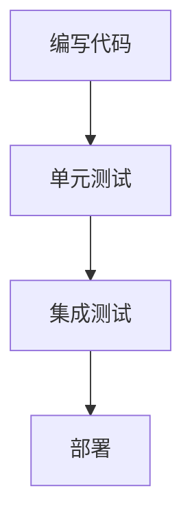
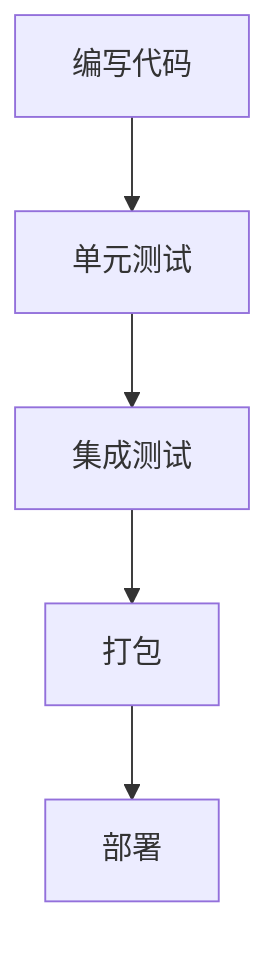
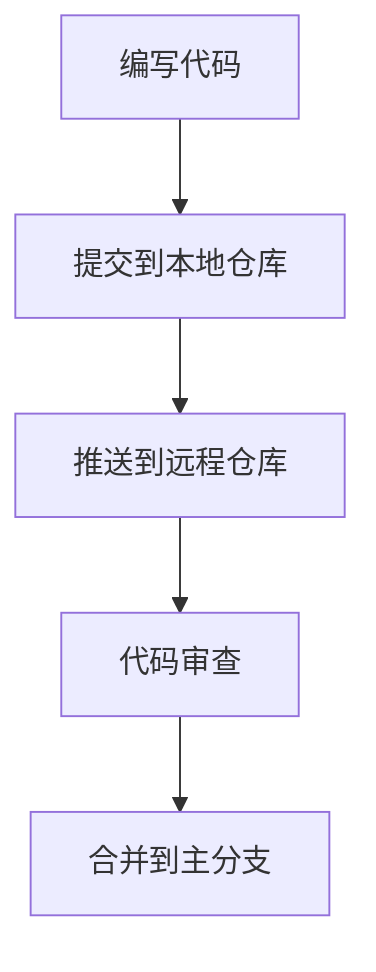
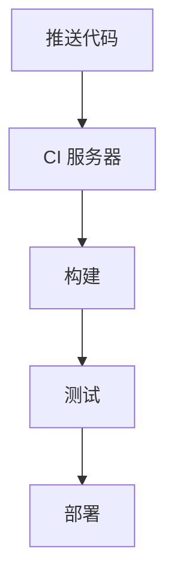

# 我的开发工具链

<!-- ## 目录
1. [前言](#前言)
2. [编程语言](#编程语言)
    1. [Python](#python)
    2. [JavaScript](#javascript)
    3. [Java](#java)
3. [版本控制](#版本控制)
4. [持续集成/持续部署 (CI/CD)](#持续集成持续部署-cicd)
5. [结论](#结论) -->

## 前言
在这篇文档中，我将介绍我在日常开发中使用的各种工具链。

## 编程语言

### C++
C++ 是我的主力编程语言之一。以下是我在C++开发中使用的主要工具：

- **IDE**: VSCode (Windows 11 + WSL2), CLion (Ubuntu 20.04虚拟机), nvim (Ubuntu 20.04虚拟机)
- **编译器**: GCC, Clang
- **构建系统**: cmake, xmake
- **调试器**：gdb, lldb

#### C++工具链配置
- **主系统**: Windows 11
VSCode 配合 WSL2（Ubuntu），用于在Windows下进行Linux环境的开发。
- **虚拟机**: VMware Ubuntu 20.04
CLion 和 nvim，提供完整的开发环境

#### C++工具链流程图

### Python
Python 是我最常用的编程语言之一。以下是我在Python开发中使用的主要工具：

- **IDE**: PyCharm, VS Code
- **包管理**: pip, conda
- **测试框架**: pytest, unittest

#### Python工具链流程图

### Kotlin
Kotlin 是企业级开发的常用语言。以下是我在Kotlin开发中使用的主要工具：

- **IDE**: Android Studio
- **包管理**: Maven, Gradle
- **测试框架**: JUnit, Selenium, jmeter

#### Kotlin工具链流程图

## 版本控制
版本控制对于协同开发和版本管理非常重要。以下是我使用的版本控制工具：

- **Git**: Git是我最常用的版本控制系统。
- **Git平台**: GitHub, GitLab, Bitbucket

### Git工作流程

## 持续集成/持续部署 (CI/CD)
CI/CD 能够帮助我们在自动化构建、测试和部署过程中保持代码的高质量。

- **工具**:  Jenkins, GitHub Actions, GitLab CI

### CI/CD 流程
